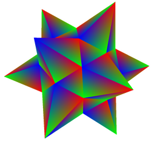
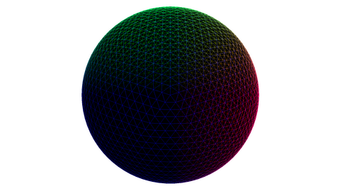

# Subdivision of surfaces

This is a project application for the course of **Computational Geometry** from the University of Milan, held by Prof. Alzati, A.Y. 2020/2021. The application
was developed with the intent of study different techniques for the triangulations and tessellations of geometric shapes using OpenGL. The
math and the algorithms are explained in depth at this [website](http://www.mat.unimi.it/users/alzati/Geometria_Computazionale_98-99/apps/trietas/index.html) held by the department of mathematics (I highly suggest
to visit if you are interested in the topic ☺).

## Dependencies

- GLFW
- GLEW
- GLM
- 

Both of these libraries are integrated with CONAN, you must have installed [CMake](https://cmake.org/download/) and [CONAN](https://conan.io/downloads.html), then follow the installation instructions.

## Install

1. Access by terminal to the folder _'Computational_Geometry'_.
2. Then run this command:

> `cmake src -DCMAKE_BUILD_TYPE=Release -B ../build/`

3. Once the process is over move to the folder _'../build'_, and run this command:

> `make`

4. Once the building is over, copy the executable file _'/bin/Application'_ inside the folder _'Computational_Geometry_2021/Computational_Geometry/'_.

5. Move to the folder where it is the executable now, in _'Computational_Geometry_2021/Computational_Geometry/'_.

6. Run the command:

> `./bin/Application`
